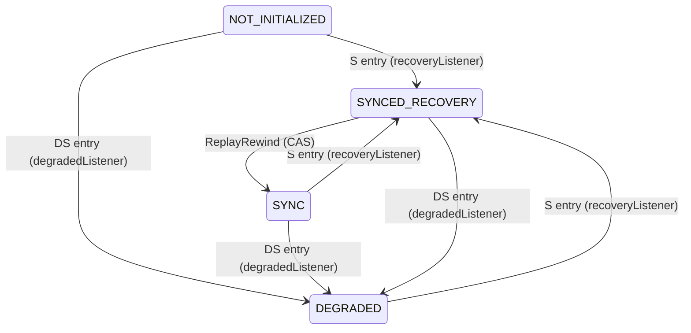

# Reader -- Standby-Side Replication Replay State Machine

**Source:** [`Reader.tla`](../Reader.tla)

## Overview

`Reader` models the standby cluster's replication replay state machine. The reader replays replication logs round-by-round, tracking two counters (`lastRoundProcessed`, `lastRoundInSync`) and a replay state that determines how the counters advance. The module contains 5 action schemas covering replay advance, rewind, in-progress directory dynamics, and the failover trigger.

### Replay State Semantics

| State | Counter Behavior |
|---|---|
| `SYNC` | Both counters advance together (in-sync replay) |
| `DEGRADED` | Only `lastRoundProcessed` advances; `lastRoundInSync` is frozen (degraded replay) |
| `SYNCED_RECOVERY` | Rewinds `lastRoundProcessed` to `lastRoundInSync`, then CAS-transitions to `SYNC` |
| `NOT_INITIALIZED` | Pre-init on the active side; transitions to `SYNCED_RECOVERY` on first S entry after failover |

### Replay State Diagram



### Listener Effect Folding

The `degradedListener` and `recoveryListener` use unconditional `.set()` (not `.compareAndSet()`). These fire synchronously on the local `PathChildrenCache` event thread during the cluster state transition and are modeled as atomic with the triggering state-entry actions in [HAGroupStore.md](HAGroupStore.md):

- **S entry:** `set(SYNCED_RECOVERY)` -- folded into `PeerReactToAIS`, `PeerReactToANIS` (ATS->S), `AutoComplete` (AbTS->S)
- **DS entry:** `set(DEGRADED)` -- folded into `PeerReactToANIS` (S->DS)

### CAS Semantics

The `SYNCED_RECOVERY -> SYNC` transition uses `compareAndSet(SYNCED_RECOVERY, SYNC)` at L332-333. The CAS can only fail if a concurrent `set(DEGRADED)` fires first (the cluster re-degrades before `replay()` can CAS). TLC's interleaving semantics model this race: either `ReplayRewind` fires first (CAS succeeds) or the DS-entry fold in `PeerReactToANIS` fires first (state becomes DEGRADED, `ReplayRewind` is no longer enabled).

## Implementation Traceability

| TLA+ Action | Java Source |
|---|---|
| `ReplayAdvance(c)` | `replay()` L336-343 (SYNC) and L345-351 (DEGRADED) -- round processing loop |
| `ReplayRewind(c)` | `replay()` L323-333 -- `compareAndSet(SYNCED_RECOVERY, SYNC)`; `getFirstRoundToProcess()` rewinds to `lastRoundInSync` (L389) |
| `ReplayBeginProcessing(c)` | `replay()` round processing start -- in-progress files created when a round is picked up |
| `ReplayFinishProcessing(c)` | `replay()` round processing end -- in-progress files cleaned up after round is fully processed |
| `TriggerFailover(c)` | `shouldTriggerFailover()` L500-533 (guards); `triggerFailover()` L535-548 (effect); `setHAGroupStatusToSync()` L341-355 (ZK write) |

```tla
EXTENDS SpecState, Types
```

## ReplayAdvance -- Round Processing in SYNC or DEGRADED

The reader processes the next round of replication logs:

- **SYNC:** Both `lastRoundProcessed` and `lastRoundInSync` advance, maintaining the invariant that they are equal. Every processed round represents a consistent state.
- **DEGRADED:** Only `lastRoundProcessed` advances; `lastRoundInSync` is frozen. Rounds processed during DEGRADED may contain incomplete data because the active peer's writers are in STORE_AND_FWD mode, buffering locally instead of writing synchronously to the standby's HDFS.

**Guard:** The cluster must be in a standby state or STA (replay continues during failover pending -- the `replay()` loop does not stop when the cluster enters STA).

Source: `replay()` L336-343 (SYNC), L345-351 (DEGRADED).

```tla
ReplayAdvance(c) ==
    /\ clusterState[c] \in StandbyStates \union {"STA"}
    /\ replayState[c] \in {"SYNC", "DEGRADED"}
    /\ lastRoundProcessed' = [lastRoundProcessed EXCEPT ![c] = @ + 1]
    /\ lastRoundInSync' = [lastRoundInSync EXCEPT ![c] =
           IF replayState[c] = "SYNC" THEN @ + 1 ELSE @]
    /\ UNCHANGED <<clusterState, writerMode, outDirEmpty, hdfsAvailable,
                   antiFlapTimer, replayState, failoverPending,
                   inProgressDirEmpty,
                   zkPeerConnected, zkPeerSessionAlive, zkLocalConnected>>
```

## ReplayRewind -- CAS to SYNC from SYNCED_RECOVERY

In `SYNCED_RECOVERY`, `replay()` rewinds `lastRoundProcessed` to `lastRoundInSync` (via `getFirstRoundToProcess()` at L389), then attempts `compareAndSet(SYNCED_RECOVERY, SYNC)` at L332-333.

The CAS can only fail if a concurrent `set(DEGRADED)` fires first (the cluster re-degrades before `replay()` can CAS). TLC's interleaving semantics model this race naturally: either this action fires (CAS succeeds, state becomes SYNC) or the DS-entry fold in `PeerReactToANIS` fires first (state becomes DEGRADED, this action is no longer enabled).

The `ReplayRewindCorrectness` action constraint in [ConsistentFailover.md](ConsistentFailover.md) verifies that after rewind, `lastRoundProcessed = lastRoundInSync`.

Source: `replay()` L323-333; `getFirstRoundToProcess()` L389.

```tla
ReplayRewind(c) ==
    /\ replayState[c] = "SYNCED_RECOVERY"
    /\ replayState' = [replayState EXCEPT ![c] = "SYNC"]
    /\ lastRoundProcessed' = [lastRoundProcessed EXCEPT ![c] = lastRoundInSync[c]]
    /\ UNCHANGED <<clusterState, writerMode, outDirEmpty, hdfsAvailable,
                   antiFlapTimer, lastRoundInSync, failoverPending,
                   inProgressDirEmpty,
                   zkPeerConnected, zkPeerSessionAlive, zkLocalConnected>>
```

## ReplayBeginProcessing -- In-Progress Directory Becomes Non-Empty

When the reader picks up a new round for processing, it creates in-progress files in the IN-PROGRESS directory. This makes the directory non-empty, blocking the failover trigger until processing completes.

**Guard:** The cluster is in a standby state or STA (replay continues during failover pending) and the in-progress directory is currently empty.

Source: `replay()` L307-310 -- `getFirstRoundToProcess()` returns a round; processing begins.

```tla
ReplayBeginProcessing(c) ==
    /\ clusterState[c] \in StandbyStates \union {"STA"}
    /\ inProgressDirEmpty[c] = TRUE
    /\ inProgressDirEmpty' = [inProgressDirEmpty EXCEPT ![c] = FALSE]
    /\ UNCHANGED <<clusterState, writerMode, outDirEmpty, hdfsAvailable,
                   antiFlapTimer, replayState, lastRoundInSync,
                   lastRoundProcessed, failoverPending,
                   zkPeerConnected, zkPeerSessionAlive, zkLocalConnected>>
```

## ReplayFinishProcessing -- In-Progress Directory Becomes Empty

When the reader finishes processing a round, it cleans up in-progress files. The directory becomes empty, allowing the failover trigger to proceed (if other guards are satisfied).

```tla
ReplayFinishProcessing(c) ==
    /\ inProgressDirEmpty[c] = FALSE
    /\ inProgressDirEmpty' = [inProgressDirEmpty EXCEPT ![c] = TRUE]
    /\ UNCHANGED <<clusterState, writerMode, outDirEmpty, hdfsAvailable,
                   antiFlapTimer, replayState, lastRoundInSync,
                   lastRoundProcessed, failoverPending,
                   zkPeerConnected, zkPeerSessionAlive, zkLocalConnected>>
```

## TriggerFailover -- STA -> AIS When Replay Is Complete

The standby cluster writes `ACTIVE_IN_SYNC` to its own ZK znode after the replication log reader determines replay is complete. This is driven by the reader component, not a peer-reactive transition. It is the final step that completes the failover.

### Four Guards

The four guards model the conditions under which failover is safe:

1. **`failoverPending[c]`** -- set by `triggerFailoverListener` (L159-171) when the local cluster enters STA. Ensures failover was properly initiated.
2. **`inProgressDirEmpty[c]`** -- no partially-processed replication log files (`getInProgressFiles().isEmpty()` at L508). Ensures all in-flight rounds have completed processing.
3. **`replayState[c] = "SYNC"`** -- the `SYNCED_RECOVERY` rewind must have completed. Without this guard, failover could proceed with degraded rounds not re-processed from the sync point. This is the key zero-RPO guard.
4. **`hdfsAvailable[c] = TRUE`** -- the standby's own HDFS must be accessible; `shouldTriggerFailover()` performs HDFS reads (`getInProgressFiles`, `getNewFiles`) that throw IOException if HDFS is unavailable, blocking the trigger.

**Guarded on `zkLocalConnected[c]`** because `triggerFailover()` calls `setHAGroupStatusToSync()` which requires `isHealthy = true`.

**Also clears `failoverPending`**, modeling `triggerFailover()` L538 (`failoverPending.set(false)`).

Source: `shouldTriggerFailover()` L500-533 (guards); `triggerFailover()` L535-548 (effect); `setHAGroupStatusToSync()` L341-355 (ZK write).

```tla
TriggerFailover(c) ==
    /\ zkLocalConnected[c] = TRUE
    /\ clusterState[c] = "STA"
    /\ failoverPending[c]
    /\ inProgressDirEmpty[c]
    /\ replayState[c] = "SYNC"
    /\ hdfsAvailable[c] = TRUE
    /\ clusterState' = [clusterState EXCEPT ![c] = "AIS"]
    /\ failoverPending' = [failoverPending EXCEPT ![c] = FALSE]
    /\ UNCHANGED <<writerMode, outDirEmpty, hdfsAvailable, antiFlapTimer,
                   replayState, lastRoundInSync, lastRoundProcessed,
                   inProgressDirEmpty,
                   zkPeerConnected, zkPeerSessionAlive, zkLocalConnected>>
```

### Relationship to Safety Properties

The `FailoverTriggerCorrectness` and `NoDataLoss` action constraints in [ConsistentFailover.md](ConsistentFailover.md) cross-check these guards via the shared operator `STAtoAISTriggerReplayGuards` (so the two constraints stay textually aligned). They verify that every STA -> AIS transition in the model satisfies `failoverPending`, `inProgressDirEmpty`, and `replayState = "SYNC"`. If `TriggerFailover` were the only action producing STA -> AIS transitions (which it is), these constraints are redundant with the action's guards -- but they serve as independent safety net checks that would catch any accidental removal of guards during specification evolution.
