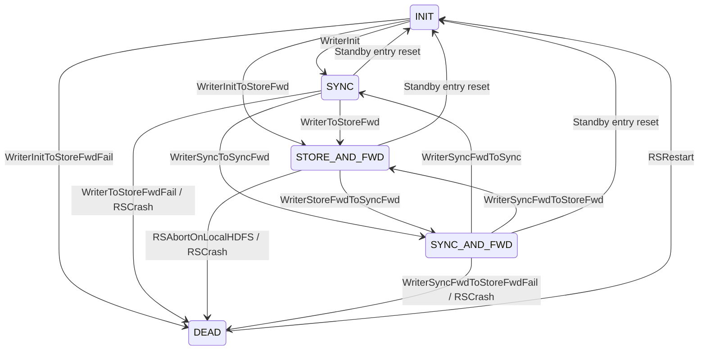

# Writer -- Per-RS Replication Writer Mode State Machine

**Source:** [`Writer.tla`](../Writer.tla)

## Overview

`Writer` models the per-RegionServer replication writer mode state machine. Each RS on the active cluster maintains a writer mode that determines how mutations are replicated: directly to standby HDFS (`SYNC`), locally buffered (`STORE_AND_FWD`), or draining the local queue while also writing synchronously (`SYNC_AND_FWD`). An RS that aborts due to a ZK CAS failure enters `DEAD` mode.

This module contains 10 action schemas, the largest action count of any sub-module. The actions decompose into four categories: startup, degradation (CAS success and CAS failure paths), recovery/drain, and forwarder-driven transitions.

### Writer Mode State Diagram



### HDFS-Failure-Driven Degradation

HDFS failure degradation (SYNC -> S&F, SYNC_AND_FWD -> S&F) is modeled as individual per-RS actions that each perform their own ZK CAS write. `HDFSDown` in [HDFS.md](HDFS.md) only sets the availability flag; per-RS degradation and CAS failure are handled here. This decomposition enables modeling of the ZK CAS race where multiple RS on the same cluster race to update the ZK state and the loser gets `BadVersionException` -> abort.

### CAS Failure Semantics

When an RS detects HDFS unavailability via IOException, it attempts a ZK CAS write (`setData().withVersion()`) to transition AIS -> ANIS (or ANIS -> ANIS self-transition). If another RS has already bumped the ZK version (stale `PathChildrenCache`), `BadVersionException` is thrown. `SyncModeImpl.onFailure()` and `SyncAndForwardModeImpl.onFailure()` treat this as fatal: `abort()` throws `RuntimeException`, halting the Disruptor -- the RS is dead.

CAS failure is only possible when `clusterState /= "AIS"` because the first RS to write faces no concurrent version bump. This is encoded in the CAS failure action guards.

### ZK Local Connectivity

Actions that perform ZK writes (`setHAGroupStatusToStoreAndForward`, `setHAGroupStatusToSync`) require `isHealthy = true`, modeled by the `LocalZKHealthy(c)` predicate from [`SpecState.tla`](../SpecState.tla) (which expands to `zkLocalConnected[c] = TRUE`). Actions that are purely mode transitions driven by HDFS operations or forwarder events (`WriterInit`, `WriterSyncToSyncFwd`, `WriterStoreFwdToSyncFwd`) do NOT require a ZK connection.

### AIS-Like State Coupling

`WriterInitToStoreFwd` and `WriterToStoreFwd` both atomically transition `clusterState` to `ANIS` and reset `antiFlapTimer` when a writer degrades from an AIS-like state. The set of AIS-like states (`AIS`, `AWOP`, `ANISWOP`) is named in [`Types.tla`](../Types.tla) as `AISLikeStates` and documented in [Types.md](Types.md#HA-Group-State-Classification).

## Implementation Traceability

| TLA+ Action | Java Source |
|---|---|
| `WriterInit(c, rs)` | Normal startup -> `SyncModeImpl` |
| `WriterInitToStoreFwd(c, rs)` | Startup with peer unavailable -> `StoreAndForwardModeImpl`; CAS success path |
| `WriterInitToStoreFwdFail(c, rs)` | Startup CAS failure -> abort |
| `WriterToStoreFwd(c, rs)` | `SyncModeImpl.onFailure()` L61-74 -> `setHAGroupStatusToStoreAndForward()`; CAS success |
| `WriterToStoreFwdFail(c, rs)` | `SyncModeImpl.onFailure()` CAS failure -> abort |
| `WriterSyncToSyncFwd(c, rs)` | Forwarder ACTIVE_NOT_IN_SYNC event L98-108 while RS in SYNC |
| `WriterStoreFwdToSyncFwd(c, rs)` | Forwarder `processFile()` L133-152 throughput threshold or drain start |
| `WriterSyncFwdToSync(c, rs)` | Forwarder drain complete; queue empty -> `setHAGroupStatusToSync()` L171 |
| `WriterSyncFwdToStoreFwd(c, rs)` | `SyncAndForwardModeImpl.onFailure()` L66-78; CAS success path |
| `WriterSyncFwdToStoreFwdFail(c, rs)` | `SyncAndForwardModeImpl.onFailure()` CAS failure -> abort |
| `CanDegradeToStoreFwd(c, rs)` | Guard predicate: RS is in a mode that writes to standby HDFS |

```tla
EXTENDS SpecState, Types
```

## Predicates

### CanDegradeToStoreFwd

Guard predicate: RS is in a mode that writes to standby HDFS and would degrade to STORE_AND_FWD on an HDFS failure.

```tla
CanDegradeToStoreFwd(c, rs) ==
    writerMode[c][rs] \in {"SYNC", "SYNC_AND_FWD"}
```

## Startup Actions

### WriterInit -- Normal Startup: INIT -> SYNC

RS initializes and begins writing directly to standby HDFS. Writers only run on the active cluster. No ZK write -- pure mode transition.

```tla
WriterInit(c, rs) ==
    /\ clusterState[c] \in ActiveStates
    /\ writerMode[c][rs] = "INIT"
    /\ writerMode' = [writerMode EXCEPT ![c][rs] = "SYNC"]
    /\ UNCHANGED <<clusterState, outDirEmpty, hdfsAvailable, antiFlapTimer,
                   replayState, lastRoundInSync, lastRoundProcessed,
                   failoverPending, inProgressDirEmpty,
                   zkPeerConnected, zkPeerSessionAlive, zkLocalConnected>>
```

### WriterInitToStoreFwd -- Startup with Peer Unavailable: INIT -> STORE_AND_FWD

RS initializes but standby HDFS is unreachable; begins buffering locally in the OUT directory. Also transitions cluster AIS -> ANIS (`setHAGroupStatusToStoreAndForward`). This is the AIS-to-ANIS coupling: the first RS to degrade atomically transitions the cluster state.

**AWOP/ANISWOP handling:** Same as `WriterToStoreFwd` -- when AWOP or ANISWOP are reachable (`UseOfflinePeerDetection = TRUE`), HDFS failure during these states triggers `setHAGroupStatusToStoreAndForward()` which CAS-writes ANIS. `AWOP.allowedTransitions = {ANIS}` and `ANISWOP.allowedTransitions = {ANIS}`, so the transition succeeds. When `UseOfflinePeerDetection = FALSE`, AWOP/ANISWOP are unreachable and the extended IF is a no-op.

Guarded on `zkLocalConnected[c]` because this calls `setHAGroupStatusToStoreAndForward()` which requires `isHealthy = true`.

Source: `StoreAndForwardModeImpl.onEnter()` L54-64.

```tla
WriterInitToStoreFwd(c, rs) ==
    /\ zkLocalConnected[c] = TRUE
    /\ clusterState[c] \in ActiveStates
    /\ writerMode[c][rs] = "INIT"
    /\ hdfsAvailable[Peer(c)] = FALSE
    /\ writerMode' = [writerMode EXCEPT ![c][rs] = "STORE_AND_FWD"]
    /\ outDirEmpty' = [outDirEmpty EXCEPT ![c] = FALSE]
    /\ clusterState' = IF clusterState[c] \in AISLikeStates
                        THEN [clusterState EXCEPT ![c] = "ANIS"]
                        ELSE clusterState
    /\ antiFlapTimer' = IF clusterState[c] \in AISLikeStates
                         THEN [antiFlapTimer EXCEPT ![c] = StartAntiFlapWait]
                         ELSE antiFlapTimer
    /\ UNCHANGED <<hdfsAvailable, replayState, lastRoundInSync,
                   lastRoundProcessed, failoverPending, inProgressDirEmpty,
                   zkPeerConnected, zkPeerSessionAlive, zkLocalConnected>>
```

## Forwarder-Driven Transitions

### WriterSyncToSyncFwd -- Forwarder Started While In Sync: SYNC -> SYNC_AND_FWD

On an ACTIVE_NOT_IN_SYNC event (L98-108), region servers currently in SYNC learn that the cluster has entered ANIS and transition to SYNC_AND_FWD. This event fires once when the cluster enters ANIS. ANISTS does not produce a new ACTIVE_NOT_IN_SYNC event -- it is a different ZK state change. A SYNC writer that has not yet received the event when ANIS -> ANISTS fires will remain in SYNC (harmlessly: SYNC writers write directly to standby HDFS, not to the OUT directory).

No ZK write -- mode transition driven by forwarder event.

Source: `ReplicationLogDiscoveryForwarder.init()` L98-108.

```tla
WriterSyncToSyncFwd(c, rs) ==
    /\ clusterState[c] = "ANIS"
    /\ writerMode[c][rs] = "SYNC"
    /\ writerMode' = [writerMode EXCEPT ![c][rs] = "SYNC_AND_FWD"]
    /\ UNCHANGED <<clusterState, outDirEmpty, hdfsAvailable, antiFlapTimer,
                   replayState, lastRoundInSync, lastRoundProcessed,
                   failoverPending, inProgressDirEmpty,
                   zkPeerConnected, zkPeerSessionAlive, zkLocalConnected>>
```

### WriterStoreFwdToSyncFwd -- Recovery Detected: STORE_AND_FWD -> SYNC_AND_FWD

The forwarder successfully copies a file from the OUT directory to the standby's IN directory. If throughput exceeds the threshold, the writer transitions to SYNC_AND_FWD to begin draining the queue while also writing synchronously. The forwarder runs on active clusters and during the ANISTS transitional state (draining OUT before ANISTS -> ATS).

No ZK write -- mode transition driven by forwarder file copy.

Source: `ReplicationLogDiscoveryForwarder.processFile()` L133-152 throughput threshold or drain start.

```tla
WriterStoreFwdToSyncFwd(c, rs) ==
    /\ clusterState[c] \in ActiveStates \union TransitionalActiveStates
    /\ writerMode[c][rs] = "STORE_AND_FWD"
    /\ hdfsAvailable[Peer(c)] = TRUE
    /\ writerMode' = [writerMode EXCEPT ![c][rs] = "SYNC_AND_FWD"]
    /\ UNCHANGED <<clusterState, outDirEmpty, hdfsAvailable, antiFlapTimer,
                   replayState, lastRoundInSync, lastRoundProcessed,
                   failoverPending, inProgressDirEmpty,
                   zkPeerConnected, zkPeerSessionAlive, zkLocalConnected>>
```

### WriterSyncFwdToSync -- Queue Drained: SYNC_AND_FWD -> SYNC

The forwarder has drained all buffered files from the OUT directory. The OUT directory is now empty.

**Per-RS vs per-cluster semantics:** `processNoMoreRoundsLeft()` (`ReplicationLogDiscoveryForwarder.java` L155-184) is a per-cluster forwarder check that examines the global OUT directory -- it only fires when the entire OUT directory is empty, not when a single RS finishes. The guard `\A rs2 \in RS : writerMode[c][rs2] \notin {"STORE_AND_FWD"}` prevents setting `outDirEmpty = TRUE` while any RS is still actively writing to the OUT directory.

**HDFS guard:** `processNoMoreRoundsLeft()` can only fire after `processFile()` has successfully copied all remaining files from OUT to the peer's IN directory, which requires the peer's HDFS to be accessible.

Guarded on `zkLocalConnected[c]` because this calls `setHAGroupStatusToSync()` which requires `isHealthy = true`.

Source: `ReplicationLogDiscoveryForwarder.processFile()` L133-152 copies to peer HDFS; `processNoMoreRoundsLeft()` L155-184; `setHAGroupStatusToSync()` L171.

```tla
WriterSyncFwdToSync(c, rs) ==
    /\ zkLocalConnected[c] = TRUE
    /\ clusterState[c] \in ActiveStates \union TransitionalActiveStates
    /\ writerMode[c][rs] = "SYNC_AND_FWD"
    /\ hdfsAvailable[Peer(c)] = TRUE
    /\ \A rs2 \in RS : writerMode[c][rs2] \notin {"STORE_AND_FWD"}
    /\ writerMode' = [writerMode EXCEPT ![c][rs] = "SYNC"]
    /\ outDirEmpty' = [outDirEmpty EXCEPT ![c] = TRUE]
    /\ UNCHANGED <<clusterState, hdfsAvailable, antiFlapTimer,
                   replayState, lastRoundInSync, lastRoundProcessed,
                   failoverPending, inProgressDirEmpty,
                   zkPeerConnected, zkPeerSessionAlive, zkLocalConnected>>
```

## Per-RS HDFS Failure Degradation -- CAS Success Paths

### WriterToStoreFwd -- SYNC -> STORE_AND_FWD (CAS Success)

Models a single RS detecting standby HDFS unavailability via IOException and successfully CAS-writing the ZK state. The ZK CAS write is synchronous and happens BEFORE the mode change (`SyncModeImpl.onFailure()` L61-74). On success, the writer transitions to STORE_AND_FWD and the cluster transitions AIS -> ANIS (if still AIS).

This is the primary AIS-to-ANIS coupling mechanism: the first RS to detect HDFS failure atomically transitions both its own mode and the cluster state.

**AWOP/ANISWOP handling:** When AWOP or ANISWOP are reachable (`UseOfflinePeerDetection = TRUE`), HDFS failure during these states triggers `setHAGroupStatusToStoreAndForward()` which CAS-writes ANIS. `AWOP.allowedTransitions = {ANIS}` and `ANISWOP.allowedTransitions = {ANIS}`, so the transition succeeds. When `UseOfflinePeerDetection = FALSE`, AWOP/ANISWOP are unreachable and the extended IF is a no-op.

Source: `SyncModeImpl.onFailure()` L61-74 -> `setHAGroupStatusToStoreAndForward()`.

```tla
WriterToStoreFwd(c, rs) ==
    /\ zkLocalConnected[c] = TRUE
    /\ clusterState[c] \in ActiveStates
    /\ writerMode[c][rs] = "SYNC"
    /\ hdfsAvailable[Peer(c)] = FALSE
    /\ writerMode' = [writerMode EXCEPT ![c][rs] = "STORE_AND_FWD"]
    /\ outDirEmpty' = [outDirEmpty EXCEPT ![c] = FALSE]
    /\ clusterState' = IF clusterState[c] \in AISLikeStates
                        THEN [clusterState EXCEPT ![c] = "ANIS"]
                        ELSE clusterState
    /\ antiFlapTimer' = IF clusterState[c] \in AISLikeStates
                         THEN [antiFlapTimer EXCEPT ![c] = StartAntiFlapWait]
                         ELSE antiFlapTimer
    /\ UNCHANGED <<hdfsAvailable, replayState, lastRoundInSync,
                   lastRoundProcessed, failoverPending, inProgressDirEmpty,
                   zkPeerConnected, zkPeerSessionAlive, zkLocalConnected>>
```

### WriterSyncFwdToStoreFwd -- Re-Degradation During Drain: SYNC_AND_FWD -> STORE_AND_FWD (CAS Success)

Models standby HDFS becoming unavailable again while the forwarder is draining the local queue. The RS falls back to pure local buffering. No AIS -> ANIS coupling needed: if RS is in SYNC_AND_FWD, the cluster is already ANIS or ANISTS (cannot be AIS).

Source: `SyncAndForwardModeImpl.onFailure()` L66-78 -> `setHAGroupStatusToStoreAndForward()`.

```tla
WriterSyncFwdToStoreFwd(c, rs) ==
    /\ zkLocalConnected[c] = TRUE
    /\ clusterState[c] \in ActiveStates \union TransitionalActiveStates
    /\ writerMode[c][rs] = "SYNC_AND_FWD"
    /\ hdfsAvailable[Peer(c)] = FALSE
    /\ writerMode' = [writerMode EXCEPT ![c][rs] = "STORE_AND_FWD"]
    /\ outDirEmpty' = [outDirEmpty EXCEPT ![c] = FALSE]
    /\ UNCHANGED <<clusterState, hdfsAvailable, antiFlapTimer,
                   replayState, lastRoundInSync, lastRoundProcessed,
                   failoverPending, inProgressDirEmpty,
                   zkPeerConnected, zkPeerSessionAlive, zkLocalConnected>>
```

## Per-RS HDFS Failure Degradation -- CAS Failure Paths (RS Abort)

These actions model the case where the ZK CAS write fails due to a version mismatch. The RS reads a stale version from `PathChildrenCache`, attempts a CAS write, but another RS has already bumped the version. ZK throws `BadVersionException` -> `StaleHAGroupStoreRecordVersionException` -> `abort()` -> `RuntimeException` -> Disruptor halts -> RS dead.

### WriterToStoreFwdFail -- CAS Failure During SYNC Degradation: SYNC -> DEAD

Guard: `clusterState[c] /= "AIS"` -- CAS failure is only possible when another RS has already changed the cluster state, meaning the ZK version has been bumped beyond the cached value. If the cluster is still AIS, the first RS to write faces no concurrent version bump, so CAS cannot fail.

Source: `SyncModeImpl.onFailure()` L61-74 catch block -> `abort()`.

```tla
WriterToStoreFwdFail(c, rs) ==
    /\ zkLocalConnected[c] = TRUE
    /\ clusterState[c] \in ActiveStates \ {"AIS"}
    /\ writerMode[c][rs] = "SYNC"
    /\ hdfsAvailable[Peer(c)] = FALSE
    /\ writerMode' = [writerMode EXCEPT ![c][rs] = "DEAD"]
    /\ UNCHANGED <<clusterState, outDirEmpty, hdfsAvailable, antiFlapTimer,
                   replayState, lastRoundInSync, lastRoundProcessed,
                   failoverPending, inProgressDirEmpty,
                   zkPeerConnected, zkPeerSessionAlive, zkLocalConnected>>
```

### WriterSyncFwdToStoreFwdFail -- CAS Failure During S&FWD Re-Degradation: SYNC_AND_FWD -> DEAD

Same CAS failure pattern as `WriterToStoreFwdFail` but from SYNC_AND_FWD mode. If RS is in SYNC_AND_FWD, the cluster is already ANIS or ANISTS (not AIS), so another RS or the S&F heartbeat may have bumped the ZK version.

Source: `SyncAndForwardModeImpl.onFailure()` L66-78 catch block -> `abort()`.

```tla
WriterSyncFwdToStoreFwdFail(c, rs) ==
    /\ zkLocalConnected[c] = TRUE
    /\ clusterState[c] \in ActiveStates \union TransitionalActiveStates
    /\ writerMode[c][rs] = "SYNC_AND_FWD"
    /\ hdfsAvailable[Peer(c)] = FALSE
    /\ writerMode' = [writerMode EXCEPT ![c][rs] = "DEAD"]
    /\ UNCHANGED <<clusterState, outDirEmpty, hdfsAvailable, antiFlapTimer,
                   replayState, lastRoundInSync, lastRoundProcessed,
                   failoverPending, inProgressDirEmpty,
                   zkPeerConnected, zkPeerSessionAlive, zkLocalConnected>>
```

### WriterInitToStoreFwdFail -- CAS Failure During Init Degradation: INIT -> DEAD

RS starts up, `SyncModeImpl.onEnter()` fails (HDFS unavailable), `updateModeOnFailure` -> `SyncModeImpl.onFailure()` -> CAS write fails -> `abort()`. Same CAS race as `WriterToStoreFwdFail` but from the INIT state during startup.

Guard: `clusterState[c] /= "AIS"` -- same rationale: another RS must have already bumped the version for CAS to fail.

Source: `SyncModeImpl.onFailure()` L61-74 via `LogEventHandler.initializeMode()` failure path.

```tla
WriterInitToStoreFwdFail(c, rs) ==
    /\ zkLocalConnected[c] = TRUE
    /\ clusterState[c] \in ActiveStates \ {"AIS"}
    /\ writerMode[c][rs] = "INIT"
    /\ hdfsAvailable[Peer(c)] = FALSE
    /\ writerMode' = [writerMode EXCEPT ![c][rs] = "DEAD"]
    /\ UNCHANGED <<clusterState, outDirEmpty, hdfsAvailable, antiFlapTimer,
                   replayState, lastRoundInSync, lastRoundProcessed,
                   failoverPending, inProgressDirEmpty,
                   zkPeerConnected, zkPeerSessionAlive, zkLocalConnected>>
```
